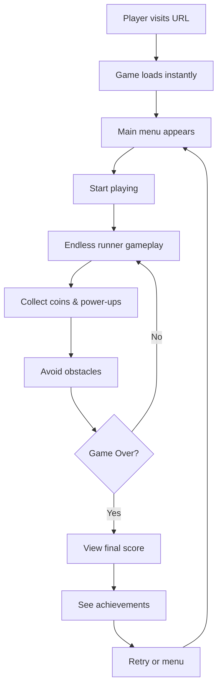

# Product Context - Otter River Rush

## Why This Project Exists

### Problem Statement
Browser-based games often suffer from:
- Poor performance on mobile devices
- Lack of offline support
- Inaccessible controls and UI
- Over-reliance on frameworks
- Poor code quality and testability

### Our Solution
Otter River Rush demonstrates that browser games can be:
- **Performant**: 60 FPS on all devices using vanilla Canvas
- **Accessible**: WCAG compliant with multiple input methods
- **Offline-first**: PWA with service worker caching
- **Well-architected**: Clean TypeScript with comprehensive testing
- **Fun**: Engaging gameplay with charming otter theme

## Problems It Solves

### For Players
1. **Entertainment**: Quick, fun gameplay sessions anywhere
2. **Accessibility**: Playable by users with various abilities
3. **Offline Play**: Works without internet connection
4. **No Installation Friction**: Play instantly in browser, or install as PWA
5. **Privacy**: No tracking, no accounts, no data collection
6. **Free**: Zero cost, no ads, no monetization

### For Developers
1. **Learning Resource**: Example of modern game architecture
2. **Best Practices**: Demonstrates TypeScript, testing, CI/CD
3. **Extensibility**: Well-structured for adding features
4. **Contribution**: Open-source project to improve skills
5. **Reference**: Real-world game development patterns

## How It Should Work

### Player Experience Flow

### Core Gameplay Loop

1. **Start**: Player selects game mode
2. **Play**: Otter auto-scrolls down river
3. **Navigate**: Player switches lanes to avoid rocks
4. **Collect**: Gather coins, gems, power-ups
5. **Progress**: Distance increases, speed increases
6. **Challenge**: Biomes change, difficulty scales
7. **Game Over**: Hit obstacle or fall off edge
8. **Results**: Display score, achievements, stats
9. **Repeat**: Encourage replay with progression

### User Experience Goals

#### Immediate Engagement
- **< 2 seconds**: Time to first interaction
- **Clear feedback**: Every action has visual/audio response
- **Intuitive controls**: No tutorial needed for basic play
- **Satisfying progression**: Constant rewards and milestones

#### Long-term Retention
- **Achievements**: 50+ goals to pursue
- **Unlockables**: Skins, effects, modes
- **Daily challenges**: Fresh content daily
- **Skill progression**: Mastery curve that rewards practice
- **Variety**: Multiple modes and biomes

#### Accessibility
- **Keyboard-only**: Full navigation without mouse
- **Touch-friendly**: Large tap targets, gesture support
- **Screen readers**: ARIA labels and semantic HTML
- **Colorblind modes**: Multiple palette options
- **Reduced motion**: Respect user preferences
- **Adjustable difficulty**: Options for all skill levels

## Key Features

### Core Features (Implemented)
- ✅ Lane-based endless runner mechanics
- ✅ Obstacle generation and collision detection
- ✅ Collectible items (coins, gems)
- ✅ Power-up system (5 types)
- ✅ Score tracking with combos
- ✅ Achievement system (50+ achievements)
- ✅ Save/load system
- ✅ Multiple input methods
- ✅ Responsive design
- ✅ PWA support

### Enhanced Features (Ready to integrate)
- 🔄 Multiple game modes
- 🔄 Biome system (4 biomes)
- 🔄 Dynamic difficulty scaling
- 🔄 Particle effects
- 🔄 Sound and music
- 🔄 Daily challenges
- 🔄 Leaderboards (local)
- 🔄 Settings menu
- 🔄 Unlockable content

### Polish Features (Planned)
- ⏳ Screen shake and juice
- ⏳ Advanced particle effects
- ⏳ Replay system
- ⏳ Ghost racing
- ⏳ Social sharing
- ⏳ Statistics dashboard

## User Stories

### New Player
> "As a new player, I want to start playing immediately without downloads or registration, so I can quickly see if I enjoy the game."

**Acceptance Criteria**:
- Game loads in under 2 seconds
- Play button immediately visible
- No account creation required
- Tutorial hints appear during first play

### Mobile Player
> "As a mobile player, I want to play offline during my commute, so I can enjoy the game without using data."

**Acceptance Criteria**:
- PWA installs on home screen
- Works offline after first visit
- Touch controls feel responsive
- UI elements are thumb-friendly

### Achievement Hunter
> "As an achievement hunter, I want to track my progress across sessions, so I can work toward completing all challenges."

**Acceptance Criteria**:
- Achievements persist across sessions
- Progress shown with percentage
- Notifications when unlocked
- Gallery to view all achievements

### Accessibility-Focused Player
> "As a player with limited vision, I want to play using keyboard only, so I can enjoy the game with assistive technology."

**Acceptance Criteria**:
- All features keyboard-accessible
- Clear focus indicators
- Screen reader announcements
- High contrast mode available

### Developer Contributor
> "As a developer, I want to understand the codebase quickly, so I can contribute new features confidently."

**Acceptance Criteria**:
- Comprehensive documentation
- Type safety throughout
- Test coverage for new code
- Clear architecture patterns

## Success Metrics

### Player Engagement
- **Session length**: Target 3-5 minutes average
- **Return rate**: 40%+ players return within 24 hours
- **Achievement rate**: 60%+ unlock at least one achievement
- **PWA install**: 20%+ install the app

### Technical Quality
- **Performance**: 60 FPS maintained 99%+ of gameplay
- **Lighthouse score**: 95+ across all categories
- **Test coverage**: 80%+ code coverage
- **Zero errors**: No runtime errors in production
- **Load time**: < 2s first contentful paint

### Developer Experience
- **Contribution rate**: Active community contributions
- **Documentation coverage**: All major systems documented
- **Code quality**: Zero linting errors maintained
- **Build time**: < 30s for production build

## Design Principles

### Gameplay Design
1. **Easy to learn, hard to master**: Simple mechanics, deep skill ceiling
2. **Constant feedback**: Visual and audio response to all actions
3. **Fair challenge**: Difficulty scales but remains beatable
4. **Rewarding progression**: Frequent small rewards, occasional big ones
5. **Variety**: Multiple modes and changing environments

### Technical Design
1. **Performance first**: 60 FPS is non-negotiable
2. **Type safety**: Strict TypeScript, no `any` types
3. **Testability**: All systems designed for testing
4. **Maintainability**: Clear patterns, good documentation
5. **Accessibility**: WCAG compliance from the start

### User Experience Design
1. **Instant gratification**: Quick to start, quick to play
2. **No barriers**: Free, no registration, no downloads
3. **Respect privacy**: No tracking, no data collection
4. **Inclusive**: Accessible to all abilities
5. **Offline-first**: Works anywhere, anytime

## Competitive Analysis

### Similar Games
- **Temple Run**: Mobile endless runner (inspiration for mechanics)
- **Subway Surfers**: Lane-based runner (UI/UX reference)
- **Alto's Adventure**: Zen-like endless runner (aesthetic inspiration)

### Our Differentiators
- **Open source**: Code available for learning
- **Web-first**: No app store needed
- **Privacy-focused**: Zero tracking or analytics
- **Accessible**: WCAG compliant from launch
- **Developer-friendly**: Comprehensive docs and tests

## Future Vision

### Phase 1: Core Game (Current)
✅ Working endless runner with all core mechanics

### Phase 2: Enhancement (In Progress)
🔄 Polish, modes, biomes, daily challenges

### Phase 3: Community (Future)
⏳ Online leaderboards, social features, user-generated content

### Phase 4: Expansion (Long-term)
⏳ New mechanics, themes, mobile apps, tournaments

---

**Document Version**: 1.0  
**Last Updated**: 2025-10-25  
**Review Frequency**: Monthly or on major feature additions

This document should be updated when user needs, feature priorities, or product direction changes.
